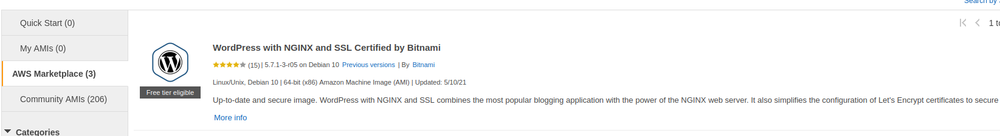

## Migrating Wordpress to the latest Bitnami 13-May-2021

### Updates
* Sep 21, 2021: added files and paths so that W3TC plugin can write to the appropriate file.
To use W3TC, before installing the plugin, add the `define('...');` line
(as you will be prompted to by W3TC) to wp-config.php, then add the plugin and
restart the server: `sudo systemctl restart bitnami.service`
* Sep 21, 2021: whitelisted JetPack's IPs for xmlrpc.php
* Sep 23, 2021: adding command to check W3TC nginx.conf file - *note that app07 is different*
```
sha256sum /opt/bitnami/apps/*/nginx.conf
c8d463dcc6fb12a728833712c83fcff06306fe9684e7cce415da53b4c0e211bd  /opt/bitnami/apps/app01/nginx.conf
c8d463dcc6fb12a728833712c83fcff06306fe9684e7cce415da53b4c0e211bd  /opt/bitnami/apps/app02/nginx.conf
c8d463dcc6fb12a728833712c83fcff06306fe9684e7cce415da53b4c0e211bd  /opt/bitnami/apps/app03/nginx.conf
c8d463dcc6fb12a728833712c83fcff06306fe9684e7cce415da53b4c0e211bd  /opt/bitnami/apps/app04/nginx.conf
c8d463dcc6fb12a728833712c83fcff06306fe9684e7cce415da53b4c0e211bd  /opt/bitnami/apps/app05/nginx.conf
c8d463dcc6fb12a728833712c83fcff06306fe9684e7cce415da53b4c0e211bd  /opt/bitnami/apps/app06/nginx.conf
874886350842768ef3df08f19ddf89997297813d5aae09e9553e85b98e896080  /opt/bitnami/apps/app07/nginx.conf
c8d463dcc6fb12a728833712c83fcff06306fe9684e7cce415da53b4c0e211bd  /opt/bitnami/apps/app08/nginx.conf

```

#### References and Notes
* https://docs.bitnami.com/aws/how-to/install-wordpress-nginx/
* https://docs.bitnami.com/aws/how-to/generate-install-lets-encrypt-ssl/
* https://docs.bitnami.com/general/how-to/generate-install-lets-encrypt-ssl/#alternative-approach
* https://docs.bitnami.com/installer/infrastructure/lamp/administration/secure-server/
* [Let's encyrpt - nginx - *Avoid with bitnami as it tried to install nginx*](https://www.nginx.com/blog/using-free-ssltls-certificates-from-lets-encrypt-with-nginx/)

Using the Wordpress with Nginx and SSL Certified by Bitnami 5.7.1-3r05 on Debian 10 AMI

*  

*Note: vim is used below.  Feel free to use nano, etc*

### Using Approach A: Bitnami installations using system packages
Do this check just to make sure your image is using the system packages

```
test ! -f "/opt/bitnami/common/bin/openssl" && echo "Approach A: Using system packages." || echo "Approach B: Self-contained installation."
Approach A: Using system packages.
```

### Initial setup
Do the following on a new image.
After this, there is no need to run these commands

```
sudo apt install -y rsync git python-apt python3-pymysql python3-pip
sudo apt autoremove
sudo apt autoclean
sudo pip3 install ansible 

# Current ansible version
/usr/local/bin/ansible --version
ansible [core 2.11.1] 
  config file = None
  configured module search path = ['/home/bitnami/.ansible/plugins/modules', '/usr/share/ansible/plugins/modules']
  ansible python module location = /usr/local/lib/python3.7/dist-packages/ansible
  ansible collection location = /home/bitnami/.ansible/collections:/usr/share/ansible/collections
  executable location = /usr/local/bin/ansible
  python version = 3.7.3 (default, Jan 22 2021, 20:04:44) [GCC 8.3.0]
  jinja version = 2.10
  libyaml = True

/usr/local/bin/ansible-galaxy collection install community.mysql

cd /home/bitnami && git clone  https://github.com/johnedstone/bitnami-wordpress-migration.git

mkdir -p /opt/bitnami/apps/configuration
touch /opt/bitnami/apps/configuration/private_vars.yaml
```

### Use ansible to set up your first application
First update `/opt/bitnami/apps/configuration/private_vars.yaml` with your private information.
This file will not be in the github respository as it's contains private information.
You can use multiple appsi (domains) in the private_vars.yaml file.

See `sample_private_vars_yaml` in this repository.

```
cd /home/bitnami/bitnami-wordpress-migration/playbooks
/usr/local/bin/ansible-playbook --check --diff --flush-cache -i inventory.ini playbook.yaml

# Or, to look more closely at dir and file permissions ...
/usr/local/bin/ansible-playbook --check --tags app_perms --flush-cache -i inventory.ini --diff playbook.yaml | egrep msg

# Or, for more verbosity
/usr/local/bin/ansible-playbook --check --tags app_perms --flush-cache -i inventory.ini --diff playbook.yaml

# Or, to look at all but dir and file permissions ....
/usr/local/bin/ansible-playbook --check --skip-tags app_perms --flush-cache -i inventory.ini --diff playbook.yaml
```

__If the above checks runs as expected, then ...__


```
/usr/local/bin/ansible-playbook --diff --flush-cache -i inventory.ini playbook.yaml

# Or, just do the dir and file permissions:
/usr/local/bin/ansible-playbook --tags app_perms --flush-cache -i inventory.ini --diff playbook.yaml | egrep msg

# Or, for more verbosity
/usr/local/bin/ansible-playbook --tags app_perms --flush-cache -i inventory.ini --diff playbook.yaml

# Or, do all but the dir and file permissions:
/usr/local/bin/ansible-playbook --skip-tags app_perms --flush-cache -i inventory.ini --diff playbook.yaml
```

After successful initial installation, __reboot__ in order to correctly set the hostname and the timezone
```
sudo shutdown -r now
```

### Rebooting the ec2 instance
If the ansible playbook says something like ...
```
failed ... rebooting the server would shutdown the server
```
then, this means that the ansible playbook has updated the server and you know
need to run the command:
```
sudo shutdown -r now
```
This will reboot the server and you can continue to run the ansible playbook

### Wordpress files
* Note: for this ansible playbook, it assumes that each database has a unique user and password
* copy over your wordpress files
* push data into database
* Feel free to remove the 0 byte index.html file that ansible installed to check the first curl
* Rerun the ansible playbook to check and update file permissions
```
# This is how you check and update the file permissions.
# Do this one time after you copy over the Wordpress files
cd /home/bitnami/bitnami-wordpress-migration/playbooks
/usr/local/bin/ansible-playbook --check --tags app_perms --flush-cache -i inventory.ini --diff playbook.yaml | egrep msg
/usr/local/bin/ansible-playbook --tags app_perms --flush-cache -i inventory.ini --diff playbook.yaml | egrep msg
```


### Running the ansible-playbook after the initial copy of the Wordpress files from their previous source
Assuming that you've checked and updated the file permissions after copying the Wordpress files, then
it is not necessary to continue to check and update file permissions.
Wordpress is constantly changing permissions and owner while it is running, so we can skip cheking permissions.
Therefore, one can run ansible as described below, and skip checking the file permissions
```
# This is how to skip checking and updating the file permissions,
# after you've checked/updated them the first time (see above)
# This will be your most common ansible-playbook command after the file permissions are checked and updated.
/usr/local/bin/ansible-playbook --check --skip-tags app_perms --flush-cache -i inventory.ini --diff playbook.yaml
/usr/local/bin/ansible-playbook --skip-tags app_perms --flush-cache -i inventory.ini --diff playbook.yaml
```

### Running the ansible playbook on just one domain, one app
It is possible to run the ansible playbook on only one domain.  This will decrease
the verbosity of the output.  Simply set `enable: no` in private_vars.yaml for all of the apps except
the app that you you'd like to check at the moment.  This does not effect the 
configuration for the apps where `enable: no` is set - the configurations for these apps are simply ignored.
Again, since this will probably be done long after the initial copy of the source Wordpress files
you can use the tag `--skip-tags app_perms` as shown below
```
/usr/local/bin/ansible-playbook --check --skip-tags app_perms --flush-cache -i inventory.ini --diff playbook.yaml
/usr/local/bin/ansible-playbook --skip-tags app_perms --flush-cache -i inventory.ini --diff playbook.yaml
```
### Changing the upload limits

* To update php.ini use the two variables in private_vars.yaml: `post_max_size` and `upload_max_filesize`.  The current bitnami default 80M for each.
* To update the relevant app's nginx conf file use the private_vars.yaml variable: `client_max_body_size`.  The current nginx default is 1M
* Remember too, if necessary, to change the Wordpress Formidable setting if needed.
* Not implemented, yet: To update the limit for phpmyadmin use the private_vars.yaml variable `phpmyadmin_client_max_body_size`

### Adding a custom nginx conf file for an application

```
mkdir /opt/bitnami/apps/<your_app>/custom_nginx_conf

# Add your custom configuration with the editor of your choice
vim /opt/bitnami/apps/<your_app>/custom_nginx_conf/custom.conf

# And, update your private_vars.yaml variable custom_nginx_conf
# with the path to your file

# In this custom.conf file you might have a path
# to Jet Pack's nginx.conf file such as this
include "/opt/bitnami/apps/<your_app>/nginx.conf";
# Note: JetPack will also ask you to update wp-conf.php with a define('...') statement

```

### Lets Encyrpt
* Ths playbook uses this approach: [Reference](https://docs.bitnami.com/general/how-to/generate-install-lets-encrypt-ssl/#alternative-approach)
* This playbook will install lego and the cronjobs to renew the Let's Encrypt certs 
* To update lego, simply remove `/opt/bitnami/letsencrypt/lego` and rerun the playbook.
* `private_vars.yaml` allows one to use the server certs or Let's Encrypt certs
* This may be a good time to set `wp_cron_disable: no` in private_vars.yaml
* The Let's Encrypt certs must be manually installed the first time for each domain as described below:

```
sudo /opt/bitnami/apps/letsencrypt/lego --path /opt/bitnami/apps/letsencrypt --http --http.webroot /opt/bitnami/apps/acme_validation --domains "www.xyz.net"  --email 'johndoe@johndoe.com' run

# After certs are in place, update private_vars.yaml to 'use_lets_encrypt: yes' and 'lego_cron_disable: no' and rerun playbook
# This will restart bitnami.service. Check playbook output to confirm the certs are configured correctly
# Use these commands
cd /home/bitnami/bitnami-wordpress-migration/playbooks
/usr/local/bin/ansible-playbook --check --diff --skip-tags app_perms --flush-cache -i inventory.ini playbook.yaml
/usr/local/bin/ansible-playbook --diff --skip-tags app_perms --flush-cache -i inventory.ini playbook.yaml

```

### Switching IPs
* If one is using Elastic IPs that would be preferred over changing DNS entires

### Sanity Checks

```
#  Besides the playbook, one can manually verify the certs as follows:
openssl s_client -connect localhost:443 -servername www.xyz.net < /dev/null
openssl s_client -connect localhost:443 -servername www.xyz.net < /dev/null 2>/dev/null | openssl x509 -noout -dates

# Check cronjobs
crontab -l
sudo crontab -l

# View current nginx conf files (use spacebar to advance for 'more')
ls -ltra /opt/bitnami/nginx/conf/server_blocks/
more /opt/bitnami/nginx/conf/server_blocks/*

# Check nginx config to see if it's syntax is correct
sudo /opt/bitnami/nginx/sbin/nginx -t
sudo /opt/bitnami/nginx/sbin/nginx -T

# List Wordpress directories, i.e. not redirects
ls -ltra /opt/bitnami/apps/

# List certs (either of these works)
sudo ls -ltra /opt/bitnami/letsencrypt/certificates/
sudo /opt/bitnami/letsencrypt/lego --path /opt/bitnami/letsencrypt list

# Force ansible playbook to restart bitnami:
#  add a meaningless line to conf file which will be removed
#  and rerun ansible playbook to "fix" this which will restart bitnami.service
#  which will recheck the urls by the handlers
#  Note: replace the phrase below <your-server.conf> file with an existing file
sudo echo "# comment line" >> /opt/bitnami/nginx/conf/server_blocks/<your-server.conf>

# Manually removing an unneeded nginx config file
sudo rm -i /opt/bitnami/nginx/conf/server_blocks/<www.your-unneeded-domain.org>

```

<!--
# vim: ai et ts=4 sw=4 sts=4 nu
-->
