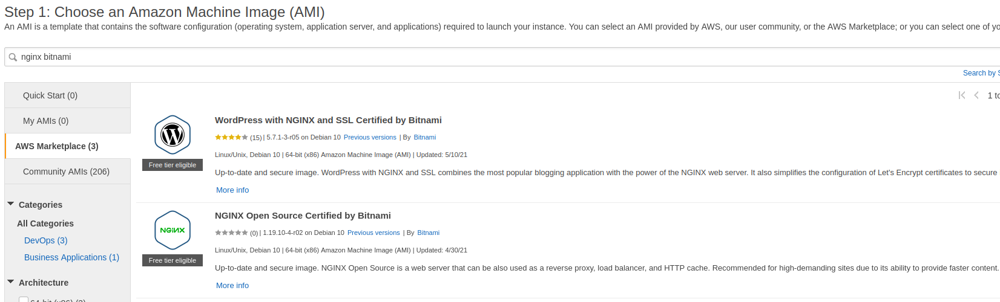

## Migrating Wordpress to the lates Bitnami 13-May-2021

Either the Bitnami Nginx or the Bitnami Wordpress AMI could be used, as they
are essentially the same.  The Wordpress AMI might have a few more clues, and then
one could just remove the config/files/db for the default Wordpress.

*  

*Note: vim is used below.  Feel free to use nano, etc*

#### References
* https://docs.bitnami.com/aws/how-to/install-wordpress-nginx/
* https://docs.bitnami.com/aws/how-to/generate-install-lets-encrypt-ssl/

### Initial setup

Using Approach A: Bitnami installations using system packages
```
test ! -f "/opt/bitnami/common/bin/openssl" && echo "Approach A: Using system packages." || echo "Approach B: Self-contained installation."
Approach A: Using system packages.
```

Initial Setup
```
# replace ip-hostname with your hostname-of-choice
sudo vim /etc/hostname

sudo shutdown -r now

sudo apt update
sudo apt full-upgrade
sudo shutdown -r now

sudo mkdir /opt/bitnami/apps
sudo chgrp daemon /opt/bitnami/apps
sudo chmod 0775 /opt/bitnami/apps
ln -s /opt/bitnami/apps ~/apps
```
